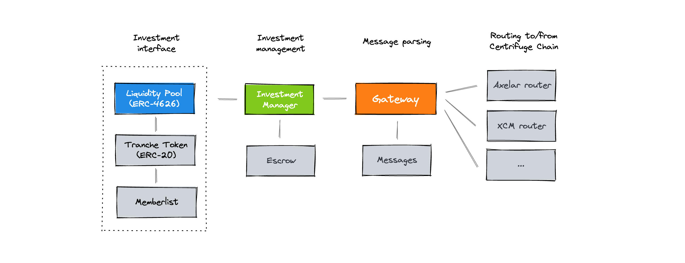

# Liquidity Pools
Liquidity Pools enable seamless deployment of Centrifuge RWA pools on any EVM-compatible blockchain.

## How it works


Investors can invest in multiple tranches for each RWA pool. Each of these tranches is a separate deployment of a Liquidity Pool and a Tranche Token.
- [**Liquidity Pool**](https://github.com/centrifuge/liquidity-pools/blob/main/src/LiquidityPool.sol): A [ERC-4626](https://ethereum.org/en/developers/docs/standards/tokens/erc-4626/) compatible contract that enables investors to deposit and withdraw stablecoins to invest in tranches of pools.
- [**Tranche Token**](https://github.com/centrifuge/liquidity-pools/blob/main/src/token/Tranche.sol): An [ERC-20](https://ethereum.org/en/developers/docs/standards/tokens/erc-20/) token for the tranche, linked to a [`RestrictionManager`](https://github.com/centrifuge/liquidity-pools/blob/main/src/token/RestrictionManager.sol) that manages transfer restrictions. Prices for tranche tokens are computed on Centrifuge.

The deployment of these tranches and the management of investments is controlled by the underlying InvestmentManager, TokenManager, Gateway, and Routers.
- [**Investment Manager**](https://github.com/centrifuge/liquidity-pools/blob/main/src/InvestmentManager.sol): The core business logic contract that handles pool creation, tranche deployment, managing investments and sending tokens to the [`Escrow`](https://github.com/centrifuge/liquidity-pools/blob/main/src/Escrow.sol) and [`UserEscrow`](https://github.com/centrifuge/liquidity-pools/blob/main/src/UserEscrow.sol), and more.
- [**Pool Manager**](https://github.com/centrifuge/liquidity-pools/blob/main/src/PoolManager.sol): The second business logic contract that handles currency bookkeeping, and transferring tranche tokens as well as currencies.
- [**Gateway**](https://github.com/centrifuge/liquidity-pools/blob/main/src/gateway/Gateway.sol): Intermediary contract that encodes and decodes messages using [`Messages`](https://github.com/centrifuge/liquidity-pools/blob/main/src/gateway/Messages.sol) and handles routing to/from Centrifuge.
- [**Routers**](https://github.com/centrifuge/liquidity-pools/tree/main/src/routers): Contracts that handle communication of messages to and from Centrifuge Chain.

## Developing
#### Getting started
```sh
git clone git@github.com:centrifuge/liquidity-pools.git
cd liquidity-pools
forge update
```

#### Testing
To run all tests locally:
```sh
forge test
```

## License
This codebase is licensed under [GNU Lesser General Public License v3.0](https://github.com/centrifuge/centrifuge-chain/blob/main/LICENSE).
