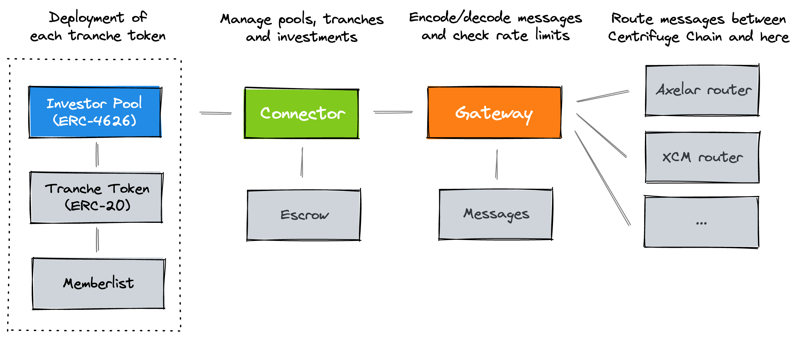

# Connectors
Connectors enables seamless deployment of Centrifuge RWA pools on any EVM-compatible blockchain.

## How it works
<a href="https://github.com/centrifuge/connectors">
  
</a>

Investors can invest in multiple tranches for each RWA pool. Each of these tranches is a separate deployment of an Investor Pool and a Tranche Token.
- **Investor Pool** (WIP): A [ERC-4626](https://ethereum.org/en/developers/docs/standards/tokens/erc-4626/) compatible contract that enables investors to deposit and withdraw stablecoins to invest in tranches of pools.
- [**Tranche Token**](https://github.com/centrifuge/connectors/blob/main/src/token/restricted.sol): An [ERC-20](https://ethereum.org/en/developers/docs/standards/tokens/erc-20/) token for the tranche, linked to a [`Memberlist`](https://github.com/centrifuge/connectors/blob/main/src/token/memberlist.sol) that manages transfer restrictions.

The deployment of these tranches and the management of investments is controlled by the underlying Connector, Gateway, and Routers.
- [**Connector**](https://github.com/centrifuge/connectors/blob/main/src/Connector.sol): The core business logic contract that handles pool creation, tranche deployment, managing investments and sending tokens to the [`Escrow`](https://github.com/centrifuge/connectors/blob/main/src/Escrow.sol), and more.
- [**Gateway**](https://github.com/centrifuge/connectors/blob/main/src/routers/Gateway.sol): Intermediary contract that encodes and decodes messages using [`Messages`](https://github.com/centrifuge/connectors/blob/main/src/Messages.sol) and perform validations such as rate limits.
- [**Routers**](https://github.com/centrifuge/connectors/tree/main/src/routers): Contracts that handle communication of messages to and from Centrifuge Chain.

## Developing
#### Getting started
```sh
git clone git@github.com:centrifuge/connectors.git
cd connectors
forge update
```

#### Testing
To run all tests locally:
```sh
forge test
```

## License
This codebase is licensed under [GNU Lesser General Public License v3.0](https://github.com/centrifuge/centrifuge-chain/blob/main/LICENSE).
